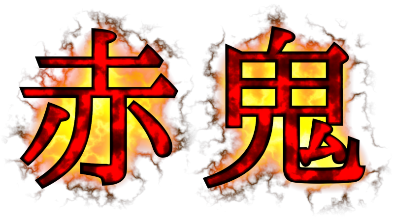

## Teh Intro

Hey guess what? **Ibuki** is pretty cool, and it would be nice to be able to play as the **Red Oni**. So maybe she deserves a standalone mod of her own, with really cool guns and stuff.

So, while **Demo-chan** was out there blastin' away in the US, **Ibuki** too had her own adventures defending the home front. Many tales would be told by those among the invading demons who were lucky to survive, that a *"naked woman with gigantic breasts"* was slaughtering their forces. They would all get laughed at, of course, what kind of story is that?

---

## Abilities

**Ibuki** is pretty goddamn hardcore. For starters, most things are very likely to not even deal any damage unless they hit REALLY hard. Bullets and melee will simply tickle you most of the time, and various other damages will also be reduced. Also, due to the fact you can't bleed, you're immune to poison, unless it's breathed in.

If your health drops to zero, you will be incapacitated. In this state, you're effectively dead as far as the game is concerned, but you can still get back up. Reviving comes at a price, however. A temporary debuff that makes you more sensitive to damage. The more times you fall, the harder it'll get, so try not to be reckless, or you'll find yourself reaching for the *"quickload"* button.

Your increased bone and muscle density make you unable to float in water. You will sink to the bottom unless you actively keep pushing yourself up *(luckily you can breathe underwater)*. Your bulk and strength allow you to easily shove enemies out of the way, unless they're just too heavy. You press a dedicated "push" button to do so on the spot which, unlike the "quick kick", can be used even while firing or reloading weapons. Do note that you need to be standing on a solid surface to use it, as it involves stomping on the floor with all your strength.

As **Saya** often states, you are effectively *"bulletproof"* and therefore you don't really need to wear armor, or clothes, so all you've got on you is some minimal clothing for *"modesty"*: a simple black bikini and jacket, as well as some sandals.

Now, you might be wondering: *"Where would your equipment go?"*. Well, unlike the **Demolitionist**, there is no need for **Ibuki** to use physical Hammerspace devices. Her natural magic bond has allowed her to develop something far more useful and easily accessible: The cleavage gateway *(no, seriously)*. The gap between her breasts is directly connected to a dedicated storage space, allowing her to switch weapons and manage her items by simply pulling them out or shoving them in. A direct mental link lets her keep track of everything in her inventory, and pick exactly what she wants beforehand.

Note: **Ibuki** is 2.2m tall *(7'3" for 'mericans)*, which would generally make it difficult to move around in maps. While normal crouching is already a thing, there's also a special "auto-duck" feature that will allow her to easily fit into spots that are at least 56 map units tall, immediately fixing that issue. This feature is NOT dependent on crouching, so it won't break in maps that disable it.

---

## Weaponry

**Ibuki**'s arsenal is a very personal one, composed of some of her favorites of all time (some of which are a bit too old, maybe, but still "gold").

Most weapons have the usual obvious controls of fire to shoot and reload to... reload.

Mag management is entirely hassle-free, as ammunition is autoloaded on-demand within Hammerspace.

### Slot 1 - Unarmed *[Fist, Staff]*

*"Sometimes you gotta do things manually."*

Guns of your own making, two of them. Bash in some skulls.

You can press reload to blow a magic kiss at enemies. Do note that your kisses are much stronger than **Demo-chan**'s.

### Slot 2 - Ninnacht AA12 *[Pistol, Elven Wand]*

*"The perfect tool for solving problems in an advanced way."*

**Ibuki**'s most prized possession. She would never go out into the field without it. 12 Gauge, 300 RPM, 32-round drum mag, truly a beauty.

While you'd usually just hold the trigger and let 'er unload, you can also use quick taps to do single shots. Do note that thanks to its cleverly designed gas-operated firing mechanisms, recoil is almost nonexistent, so unload away without fear, you won't miss the target.

#### 12 Gauge *(#1 Buckshot)* *[Clip, Shells, Wand Crystals]*

*"Small, but powerful."*

Shells are usually found in handfuls of 4, or in 12 round boxes.

### Slot 3 - Ninnacht .50 PE Brave Beagle *[Shotgun, Ethereal Crossbow]*

*"Oh, this puppy really does bite."*

A beefy handcannon of the olden days, made quite popular thanks to it being featured in practically every action movie and shooter game. It has resisted the test of time, and even some **UAC** marines are known to carry them. The official full naming of the caliber, devised by **Blackmann Arms**, cannot be disclosed without prompting chuckles from **Saya**.

It would seemingly kick like a mule, but **Ibuki** doesn't have much trouble with that. Has a propensity to turn squishy targets into meatloaf.

You'd think this could be dual-wielded, but nope, one puppy is more than enough.

#### .50 PE *[Shells, Ethereal Arrows]*

*"\*snicker\* Wait, it actually means THAT?"*

Found in 7 round mags. Spare rounds may sometimes spawn too.

### Slot 4 - Garrett MK.77 "Survivor" *[Super Shotgun, Ethereal Crossbow]*

*"There WAS a hell knight..."*

Having miraculously come out unscathed from the **White Scar**, the **Garrett Gunners Group** celebrated with the creation of this .50 OMG over-under hunting rifle, popular among wastelanders at the time, and more popular nowadays among survivors of the demonic invasion of 2148, for its ability to *"erase"* beastly Hell nobles.

A quick double-tap can shoot both barrels almost simultaneously.

#### .50 Oh My God *[Shells, Ethereal Arrows]*

*"I don't think these really are that OMG-worthy, I've seen bigger."*

Found as either spare rounds or 10 round packs.

### Slot 5 - ANFES "Melisa" Machine Gun *[Chaingun, Dragon Claw]*

*"I see we are kindred spirits, you and I."*

A true Spanish beauty, popularly known as ***"La Tetuda"** (The One With The Big Tits)*. It's designed to handle **7.62mmMT** rounds, specifically, also of **ANFES** manufacture. **MT** ammunition is well-known for *"setting the air on fire"* as it travels, despite not containing any incendiary material.

It should be noted that this was one of the very first commercial firearms to feed ammunition directly from hammerspace, removing the need to carry bulky ammo belts around. Simply being linked to an external ammo box or an autoloader within storage will allow it to fire uninterrupted regardless of its physical distance from the source of ammunition.

#### 7.62×54mmMT *[Bullets, Claw Orbs]*

*"Wait, you're telling me these aren't tracer rounds?"*

Very likely to be found in 100 round belts or lesser.

### Slot 6 - Kemet ST20 *[Rocket Launcher, Phoenix Rod]*

*"Ah yes, the ultimate problem solver. Just shoot them with this, and watch all those problems fly away."*

A man once thought about somehow custom-crafting **20mm tandem HEAT-MP** rounds, and despite all sane logic dictating this to be *very wrong and very not practical*, **he succeeded**. This is the only weapon ever made for that ammunition. Have fun!

The fact that this weapon still exists and ammunition for it is still manufactured shows that there is **SOMEHOW** demand for something like this. The world is a strange place indeed.

#### 20mm Mk.299 Tandem HEAT-MP *[Rockets, Flame Orbs]*

*"This... This is literally a tiny thermonuclear bomb squeezed into 20 millimeters... How?"*

Usually found as single rounds or in 5 round packs. You're lucky that **Cyrus** knows a guy who knows another guy who can supply you with these on the field.

### Slot 7 - Cryptik "Psyker" Plasma Carbine *[Plasma Rifle, Hellstaff]*

*"Ah... Now this is a blast from the past."*

One of humankind's proudest achievements in plasma weaponry. While it's definitely *"old-fashioned"* compared to the more modern solutions of **Nukuri** and **Xekkian** manufacture, it is sufficiently effective by human standards, having even survived the test of time through several revisions since its first introduction in the mid-2030s.

Look, **Ibuki** just loves guns that have *"aged like a fine wine"*, and this is one of them. One would probably also say she likes it because it's all black and red, her two favorite colors.

Unlike most other plasma weapons of modern times, the Psyker doesn't need to let others know it's a plasma weapon by constantly emitting light.

#### Plasma Cell *[Cells, Runes]*

*"Nice and simple, how things used to be before they started putting all those random fancy lights on them."*

Plasma ammunition is generally found in **NATO** standard 60x72mm compressed argon cells. Each of these allows for 30 shots of the **Psyker**. Note that your autoloader has support for consolidating plasma charges too, so partial reloads won't be as wasteful.

### Slot 8 - Cyrus "Quaker" Portable Cannon *[BFG 9000, Firemace]*

*"This one's kinda hard to pull out of my cleavage, but it's worth it."*

Portable **120mm** artillery? It's all possible thanks to **Cyrus Enterprises**. Just be sure to have enough room in your **Hammerspace** to store up plenty of rounds to blast 'em all to bits. Do note that you need to manually eject fired rounds in order for the auto-loader to feed another.

#### 120mm "Redeemer" Warhead *[Cells, Mace Spheres]*

*"Adios, motherfucker..."*

They're fairly hefty and stick out like a sore thumb. Still, they're somewhat rare to find. Redeemers have a fairly wide blast radius, cooking everything within range in less than a second.

### Slot 9 - Areka "Boar Slayer" 50mm *[Chainsaw, Gauntlets of the Necromancer]*

*"Got this one as a gift from a nice Xekkian girl. Oh, I still remember that night..."*

The **Boar Slayer** is clearly not meant for human use, but that's definitely not going to stop you now, is it? This has received the designation of a *"pistol rifle"* by **Xekkians**, although some would describe it more as a pump-action grenade launcher that happens to fire 50mm bullets.

Ammo for this *(very large)* puppy is quite rare, but that's compensated by how devastating even a single shot can be. Takes 5 bullets in the mag plus one in the chamber, though usually just one bullet is enough to absolutely destroy several targets.

#### 50mm Areka *[Rockets, Flame Orbs]*

*"... I wonder if... With that size..."*

Available as either single rounds or bunches of 2 and 3. These things are absolute chonkers.

### Slot 0 - The Purifier *[Chainsaw, Gauntlets of the Necromancer]*

*"Ah, the American pastime..."*

A slab of pure almasteel molded into the shape of a simple baseball bat. It's said that this thing is capable of *"literally beating the soul out of people"*. A rather drunk **Ashley Knox** asked **Misa** to make this as a birthday gift because it would allow you to *"exorcise evil spirits or some shit"*. **Saya** is very aware of the reference she was trying to make.

Pressing reload throws a ball in front of you, which can be struck with the bat for ranged attacks. An endless supply of balls is provided through Hammerspace. This action can still be performed while holding primary fire.

Should be noted that this weapon allows you to strike at enemy projectiles to send them back, if timed correctly.

## Items

Gotta have some of these too to help in your adventure. **Ibuki** will happily hoard what she doesn't need to use right away. Items that are at max capacity will not be picked up, but nevertheless they will still be tallied and have their script specials activate when touched.

### Soft Candy *[Health/Armor Bonus, Time Bomb of the Ancients]*

*"Nothing like a sweet little treat to calm my nerves..."*

A small appetizer. Flavors are randomized, each giving anywhere between 1 and 6 HP. Keep in mind **Ibuki** loves snacking as much as **Saya**, so she'll munch on these even if she doesn't need the healing.

### Water Bottle *[Stimpack, Medikit, Crystal Vial, Quartz Flask]*

*"I know a sizable number of people who should drink more of this, because they sure are thirsty..."*

Staying hydrated is important. Available in two sizes, recovering 10 HP and 25 HP each.

### Spiritual Stimulant *[Soulsphere, Megasphere, Mystic Urn]*

*"Ohhhhh... That feels good..."*

A potent overheal of 100 HP with no upper cap whatsoever. Note that any healing above 100 will wear off over time, faster the higher it's at. Megaspheres are replaced by two of them, for a 200 HP boost.

### Oil Bottle *[Green Armor, Blue Armor, Silver Shield, Enchanted Shield]*

*"Time to oil up..."*

Increases your damage resistance, somehow *(something about **Ibuki**'s skin)*. The more you rub on, the better. Note that going for a swim will cause you to rapidly lose this protection.

### Hammerspace Embiggener *[Backpack, Bag of Holding]*

*"Heh... Nerd..."*

Lets you carry more ammo. Your plan allows for up to 8 expansions. In addition, each redeemed card comes with a free delivery of ammo for most of your weapons.

### LiSA Room Tearing Device *[Blursphere, Shadowsphere, Morph Ovum]*

*"Saya keeps laughing at the name of this thing. I don't really get it."*

A very potent timed explosive. Make sure to take cover, because it hits hard. Used through a dedicated keybind, rather than the inventory bar.

### Bootleg "Mischievous Ellen" Vodka *[Berserk, Tome of Power]*

*"Bottoms up!"*

This will bring you back to full health and give you a fairly decent strength boost *(Enough to tear enemies apart with your bare hands)*. Do note however that **Ibuki**'s body metabolizes the drunkedness away quickly. Part of **Ellen**'s seemingly unending stash.

### Omnisight *[Computer Map, Map Scroll]*

*"Good thing I brought along my tablet, or I'd get lost in this dump."*

Fills out the data for your automap, basically.

### Red Oni Milk Jug *[Invulnerability, Ring of Invincibility]*

*"I taste so delicious~"*

This thing can get you so pumped up you pretty much become unstoppable after chugging it. Talk about getting high off your own supply...

### Glow Visor *[Lite-Amp, Torch]*

*"Pretty sure this is the same model Ellen-san uses."*

Cheap and easy night vision goggles. Can be toggled if you wanna save that battery.

### Elemental Coating *[Radsuit]*

*"Sometimes you gotta wear protection..."*

The usual solution for getting into dangerous terrain. Just pop it and go for a dive. Note that while it's active, your oil will not wear off in contact with water.

### Aerial Amulet *[Wings of Wrath]*

*"It's surprising that this thing can even lift me off the ground."*

A convenient little magic artifact that allows you to float in mid-air. Far more comfortable than the **Gravity Suppressor**, but unlike that one, this has a weight limit *(poor **Demo-chan**, their shiny metal butt is just too damn heavy)*. Its effects can be conveniently toggled at will, allowing you to save up energy when needed *(don't forget to bind the "Toggle Flight" key)*.

### Safety Tether *[Chaos Device]*

*"I'm outta here, bitches."*

Allows you to make a quick escape back to the start of the map when activated. Also releases some damaging shockwaves on both endpoints in the process. Useful when you're trapped in some inescapable room, or get surrounded by an overwhelming amount of enemies.

---

## NIN Radio

*"I could listen to these all day."*

A playlist of several instrumental **Nine Inch Nails** tracks, ready to be popped into your trusty music player. Tracks are automatically shuffled and will play one after another, rather than looping per-map. This will be distributed as a separate add-on to save on size for the main package.

---

## Compatibility

**Doom** is pretty much the baseline here. **Heretic** support will be added later on but it won't be a high priority. In regards to **Hexen** I don't think it'd fit much both gameplay and story-wise. It's very likely that it'll remain solely **Doom** and **Heretic** compatible and nothing more. As there's not much id-specific here like there was with the **Demolitionist** mod, it could also work with **Freedoom**, I suppose.

Note: Playing through vanilla maps with this would be considered a storyline discrepancy, but I'm not gonna stop you.

Also Note: This would have potential with **H-Doom**, like, genuinely. **Ibuki** would totally be up for some demon pussy slaying, but I'm not even sure how that would work considering they're sprites and the player is 3D modeled.

---

*"I'm just here to have fun, and you bastards are here to provide that fun."*
